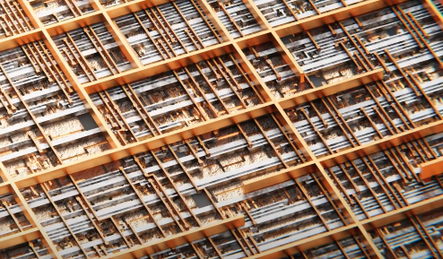
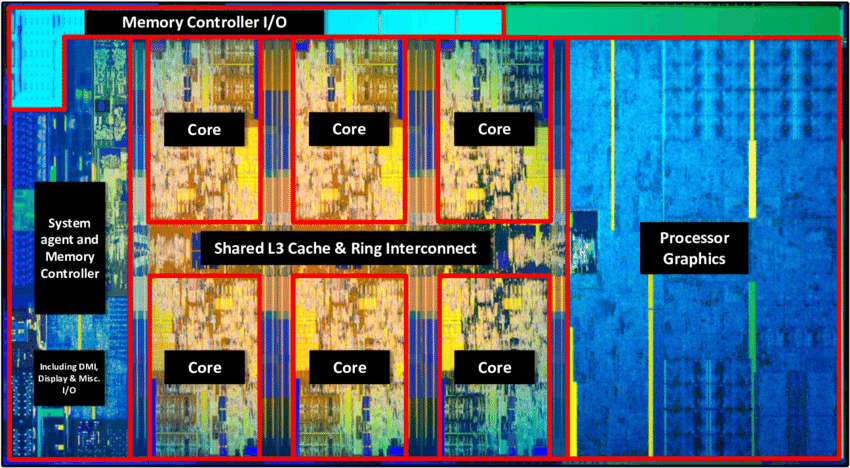

[Home](/README.md)

# CPU
aka **Central Processing Unit**

A computer system is much like a human body. It has many systems, each in charge of performing different tasks. The digestive system absorbs nutrients from the food. It also works together with the excretory system to remove waste. But they would not be able to function without the nervous system.

Much like the Central Nervous System to the body, the CPU is like the nervous system of a computer. Likewise, it sends the signals to trigger different components (organs) of the computer system (body) to perform various tasks. 

<!-- ## Core
This is the fundamental processing unit of a CPU. Most modern CPUs usually contain a few of these [IC chips](/reference.md#chips). You can think of this as the brain of the nervous system. Although these days, CPUs (nervous systems) commonly have 8 cores (brains).

### Fetch-Decode-Execute-Writeback (FDEW) cycle
aka Instruction Cycle

Each core is continuously executing the FDEW cycle at extremely fast speeds, repeating billions of times per second.
1. Fetch
    * the **Program Counter** is a crucial [**register**](./Types-of-storage.md#register) within the CPU.  -->

## CPU's Hardware
Let's begin with a dive into the physical components within the CPU, from the outer layer.

### Let's all remain cool here, and nobody gets hurt
On top sits a protective cover, called an **Integrated Heat Spreader**. It's usually made of copper or aluminum. Underneath that is another protective metal plate which houses the actual CPU printed on a PCB, also known as the **Die**. Because the tiny CPU is the brain of an entire computer system, it generates tons of heat! To offset the entire processor melting, certain *heat dissipation* techniques are used. The heat from the CPU is directed up to the heat spreader through a conducive *thermal paste*. The thermal paste and heat spreader work as very conducive materials to dissipate heat to the **Heat Sink** which sits above it all, which is itself another sandwich with thermal paste in the center. If we're comparing this to the human body, this would be the body's thermoregulatory system.

### The Die
This is the actual raw, [Integrated Circuit Chip](../reference.md#chips). This is the actual brain of the computer system. It is extremely complex and consists of an interplay between countless components within the die (processor) communicating with each other. During manufacturing, one big sheet of PCB is produced. This sheet then undergoes many chemical processes which prepares it for etching the integrated copper-metal amalgamation circuits, as well as integrating all of the components necessary to give a chip processing capabilities. This same process is applied to countless areas within that tiny sheet, and each of these segments will have contained processing capabilities. Each of these tiny segments are cut from the originally massive sheet. This is why each of these tiny IC chips are known as a "die", because they are cut from a giant grid.

### Which components are included within the die?
Let's dive into this IC chip. It's made up of many layers. The die itself is mounted on a much bigger foundational [Printed Circuit Board](../electronics/Electronic-Components.md#printed-circuit-board) (known as **CPU package substrate**) which distributes the >1000 connection points to **landing pads** that interface with the [Landing Grid Array](./Motherboard.md#landing-grid-array) on the **[Motherboard](./Motherboard.md#motherboard)**. These connection points are what allows communication of data and electrical distribution between the CPU and Motherboard.

Today's processors are partially comprised of many **Cores**. I'll cover these cores in more detail later, but for now understand that each of these cores are like self-contained, independent processing units. They are used in a modular system within the bigger *die* which utilizes them in an abstracted flow. Old CPUs were themselves their own cores. But today, we have deeply abstracted CPUs with 6-8 cores on average, allowing for drastically improved parallel processing. 

### Microscopic Circuits
When you zoom deep enough into the PCB to see where the Die's circuits have been printed, you'll notice that it looks like a tiny, microscopic city. It looks a lot like lanes and highways crossing each other. These tiny metal roads, as well as the micro-components that connect to them, were etched and deposited onto the board during manufacturing with a process called **Photo Lithography**. This process applies light and chemicals to microscopic templates created by chip designers on digital programs. Today, a [transistor](../electronics/Electronic-Components.md#transistor) (electronic gate) size ranges between 10-18 nanometers. A nanometer is literally a billionth of a meter! To give you a scale of how incredibly tiny that is, a human hair is between 80,000 to 100,000 nanometers thick. 

### Uncore, uncore!
The PCB contains billions of transistors, capacitors, and resistors which transmit data and power throughout the circuits. They comprise most of the larger hardware components on the CPU's die. And they're all connected by the conducive metal "highway" deposits and etches throughout the CPU. 

In CPUs, the larger hardware components that do not reside inside a core, but instead are in the parent layer inside the die along with the cores, are known as **uncore**. So let's walk through these uncore components. 

Because of the difference of structure between processors, we'll need to focus on just one design pictured below, with 6 cores.

#### Shared L3 Memory Cache and Ring Interconnect
aka **Last Level Cache**

The form of memory known as **cache** is magnitudes faster and smaller than [DRAM](./DRAM.md). 

The **L3 cache** runs across the chip in the center, right next to each of the 6 cores. The closer components communicating are to each other, the faster signals will reach their target.

On rare occassion, a CPU might be designed with an L4 cache which is shared between cores and the **integrated graphical processing unit (iGPU)**, but this trades speed for . 
