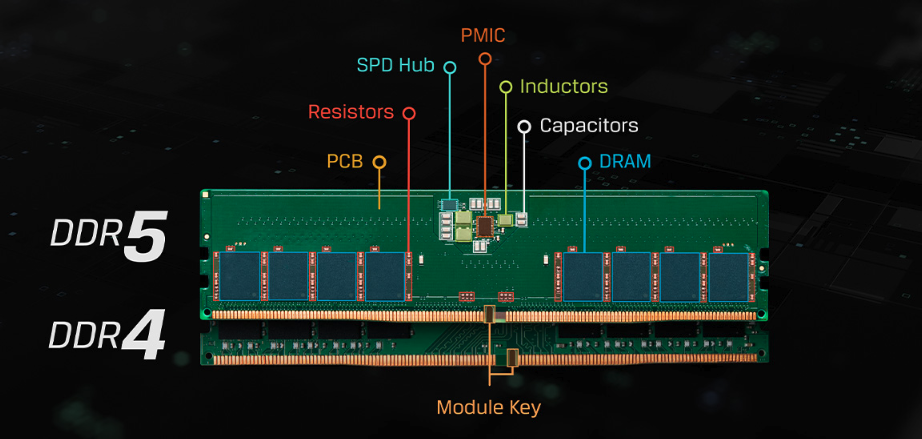

[Home](/README.md)

# Dynamic Random Access Memory (DRAM)

## What does it look like?
They are usually physically found as long, thin, rectangular PCBs plugged directly into your computer's motherboard. They are on printed circuit boards (PCBs) designed to hold multiple Dynamic Random Access Memory (DRAM) integrated circuits (ICs). 

## How is the memory actually stored?
A **Memory Cell** is the fundamental building block of computer memory, sort of like atoms to matter. But instead of a nucleus and electrons, it contains 

## DRAM vs SRAM
There are two types of memory: **Dynamic Random Access Memory (DRAM)** and **Static Random Access Memory (SRAM)**.
The major differences come in the way of: 
* the amount of transistors. DRAM only has 1 capacitor/transistor pair, while SRAM has 6 pairs. 
* SRAM's static nature allows it to hold data even after power off. DRAM's dynamic nature means it needs to constantly refresh which it will not be able to continue doing once the power's off, which we'll talk about when we cover the Memory IC chip. 
* SRAM allows for faster retrieval of data, making it more expensive. 

## DRAM
It’s found everywhere, with the shape and optimizations changing based on the type of device and its use cases. For example, the DRAM module inside your desktop PC’s tower is going to be larger, allowing for more memory per price. It will be different from the DRAM card inside your smartphone, which will be smaller to fit, and can’t hold as much memory per price.

### Random Access Memory
First, let’s go into what Random Access Memory (RAM) is. 
RAM is a type of memory that provides short-term data storage for direct access by the processor.

There are two types of RAM: 
* Dynamic Random Access Memory  -  this is the type most commonly found as main system memory within your devices. This type can hold much more data, but it’s accessed slower.
* Static Random Access Memory  -  this is the type that’s found within a CPU’s cache memory. This type can hold much less data, but it’s available faster.

### DRAM Stick
It’s also known as **Dual Inline Memory Module (DIMM)**. This version of DRAM can be found as a long, thin, rectangular card plugged into your computer’s motherboard. There are 8 DRAM chips on this particular DIMM. 

The DIMM is directly connected to the CPU via 2 memory channels (a bundle of copper traces) that are etched into the **Printed Circuit Board (PCB)**. 

The CPU uses a **memory controller** as the DRAM interface, which manages and communicates with the DRAM. The memory controller is  There’s also a separate section used as the Serial Advanced Technology  (SATA) interface, for communicating with the Hard Disk Drive (HDD) or Solid State Drive (SSD) via the plugged in SATA connectors. 

## Path of Random Access
The "random access" allows the CPU to access any location in memory directly.

It begins with the CPU, which might need a piece of data to perform an operation. 

### The fabled IC Memory Chip
The bits that create data are stored within an **Integrated Circuit (IC) Memory Chip**. Inside the memory chip, there are millions or billions of memory cells. Each of these memory cells are comprised of a capacitor (stores energy) and a transistor (switch/gate). If the gate is open and electrical current is being passed through, the memory cell holds a 1. If it's off, it holds a 0.

The memory chip is organized as a grid. The rows are known as **wordlines**, and columns are known as **bitlines**. The CPU has a **memory controller** which establishes the connection to the DRAM stick. The CPU decides what it needs and knows how to get it, the DRAM only stores On/Off bits in memory. The CPU uses logical addressing, while DRAM uses physical addressing. The memory controller translates the two signals, providing the bridge between them. When the CPU needs to access a specific point in memory, it does this by first accessing that particular memory address' wordline, followed by the bitline within that row. This process is what allows the memory to be quickly and readily available to the processor.

When the CPU needs to access data, it sends two signals. One signal is for the memory address, and the other signal is for the data bit. There is a bus dedicated to each of these two operations. It uses the memory controller to first run current through the  transistor for the memory cells in the wordline. This is akin to opening the gates. It simultaneously runs the address on the bitline for the memory cell and uses the data bit to decide if it will charge or remove charge from the capacitor in that memory cell. This is how the CPU reads and writes data in memory.

### Ahhh Refreshing!
The electrical signals being sent aren't completely on or off signals. Electrical current exists in matter at all times, in varying degrees like a spectrum. When the signal closes the transistor, it's actually a low voltage signal, with high voltage to open the gate. 
The capacitors in the memory cells lose their energy over time due to leakage through the transistor (since it's never fully closed). It needs to refresh its energy store.

The entire computer system operates on a master **system clock**. Every component in the system (CPU, RAM, memory controller) is synchronized to this clock. It generates a continuous series of precisely timed pulses called **clock cycles**. This clock system is what synchronizes the memory address signal from its own bus, and the data bit signal from the other bus. If these signals weren't synchronized, they wouldn't match up and the CPU would be receiving data bits from offset or random areas in memory. The clock system is also what the memory controller uses to periodically manage the refresh cycle. 
